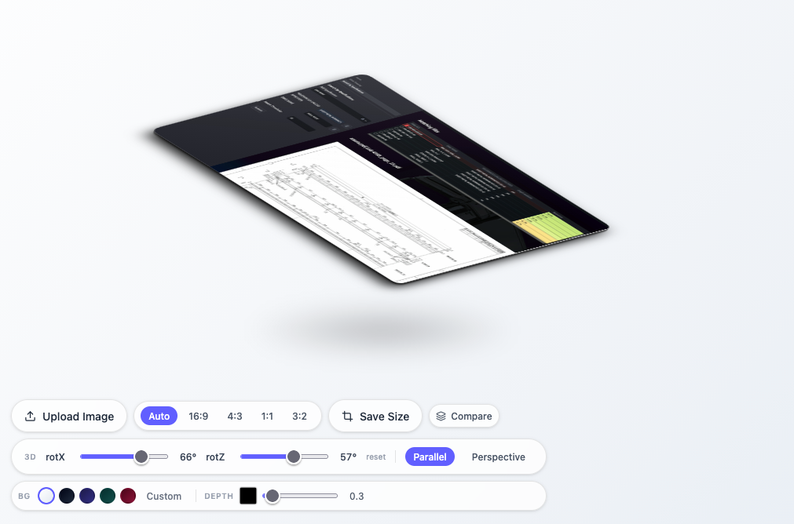

# Create Isometric 3D View

This is a code bundle for Create Isometric 3D View. The original project is available at https://www.figma.com/design/XgbcjpwmDseklXUYunNj61/Create-Isometric-3D-View.

## Running the code

Run `npm i` to install the dependencies.

Run `npm run dev` to start the development server.